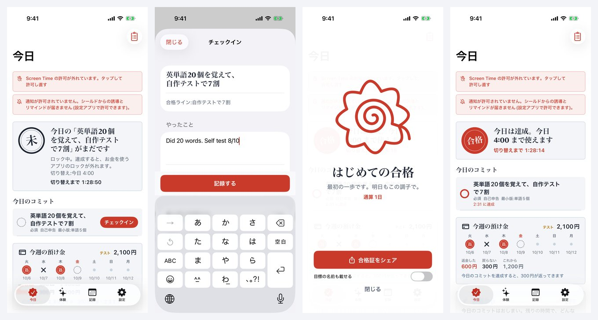
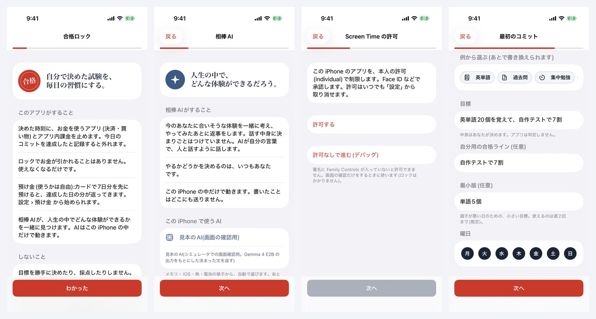
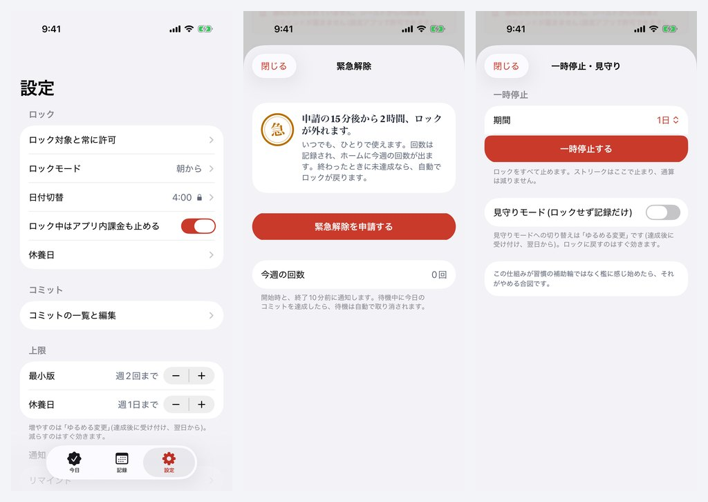

# 合格ロック(GoukakuLock)

自分で決めた試験(目標)を、毎日の習慣にするための iOS アプリ。決めた時刻に、お金を使うアプリ(決済・買い物)とアプリ内課金を止め、その日のコミットを達成したと記録すると外れます。お金は没収も送金もされず、使えなくなるだけです。

設計は「合格ロック 完全仕様書(iOS)v3.0」のとおりで、このリポジトリはその**フェーズ1(MVP)**を実装したものです。







スクリーンショットは CI の UI テストで撮ったもの(iPhone 17 シミュレータ・iOS 26.5)。シミュレータでは Screen Time の許可が得られないため、警告の帯が出ています。

見た目は「答案用紙と赤ペン」:状態は丸い印(はんこ)1つで表し、達成は朱の ◯、最小版は △、未達成は ✕ で記録します。

## いまの状態(v1.1)

| 項目 | 状態 |
|---|---|
| 判定の芯 GoukakuCore | 単体テスト 69 件が通過(macOS + Xcode 26.6、Linux + Swift 6.3.3) |
| iOS アプリ(本体+拡張4つ) | Xcode 26.6 / iOS 26.5 SDK でビルド成功(コンパイラの警告 0)。最低 iOS 18.0、iPhone 専用 |
| 画面の通し確認 | CI で iPhone 17 シミュレータ(iOS 26.5)を使い、はじめの設定 → チェックイン → はなまる → 合格証 → コミット追加 → 記録 → 設定 → 見本(ウィジェット・Live Activity)→ 集中タイマー → 緊急解除 → 一時停止まで動かしてスクリーンショットを残す |
| 実機スパイク(第20章) | **未実施**。Screen Time API はシミュレータでは動かないので、ロックそのものは実機で確かめる |
| SP-01(無料の Apple ID で使えるか) | **使えない**で確定。Apple の DTS が、Personal Team(無料)では Family Controls を使えないと回答している |

### アプリだからできること(v1.1)

| どこから | できること |
|---|---|
| ホーム画面・StandBy | ウィジェット(小・中):今日の印、残り時間、連続日数、今日のコミットの ◯/未、直近7日。タップでチェックイン画面 |
| ロック画面 | ウィジェット(円・長方形・1行):ロック中か、残り時間、今日の進み |
| ホーム画面のアイコン | 長押しで「チェックイン」「集中タイマー」(クイックアクション) |
| コントロールセンター・アクションボタン | 「合格ロックでチェックイン」ボタン |
| 通知 | リマインドやシールドの通知を長押しして、一言(5文字以上)書けばアプリを開かずに記録。最小版でも記録できる |
| Siri・ショートカット | 「合格ロックでチェックイン」「合格ロックの今日の状態」「合格ロックで集中タイマー」 |
| Dynamic Island・Live Activity | 緊急解除(待機と残り)、集中タイマー、稼働型の解除枠の残り時間 |

### 確かめ方(仕様書 フェーズ2)

- **自己申告**:一言 5 文字以上(フェーズ1)
- **集中タイマー**:アプリを前に出している時間だけを数える。離れると一時停止、厳格モードなら 0 から。実行中は画面を点けたまま
- **写真**:アプリ内のカメラで撮ったものだけ(ライブラリからは選べない)。位置情報は残さず、90 日で消す
- **使用時間(自動)**:選んだ学習アプリをその日に合計 N 分使うと、アプリを開かなくても自動で達成(DeviceActivity のしきい値)
- **稼働型**:いつもはロックし、計れる方法でチェックインするたびに決めた時間だけ外れる(バイト感覚)

### 続けたくなる工夫

- 節目(はじめての達成、連続 3・7・14・21・30・50・100… 日)に、赤ペンの「はなまる」を描くお祝いと触覚
- 合格証の画像をシェア(載せるのは連続・通算と、本人が選んだときだけ目標の名前)
- はじめて合格したあと、ウィジェットをまだ置いていなければ、ホームに一度だけ置き方の案内(置けば消える・閉じたら二度と出ない)
- 連続 7・30・100 日で解放される別アイコン(墨・金・桜)
- 目標の例から選べる(英単語・過去問・集中勉強・読書・語学アプリ・筋トレ・楽器・プログラミング)
- この2週間の ◯△✕、週に1回のふり返り(3つだけ)、2週間続いたら「一段上げる」の提案(提案だけ)
- 3日続けて未達成なら、追い込まずに「下げる・休む・止める」を並べる(フェーズ1から)

安全の床(緊急解除・一時停止・やめる合図・没収しない)はそのまま。依存させる仕掛けではなく、続けるのが楽になる方向だけを足しています。

### 実装したもの(フェーズ1)

- S-01 はじめの設定(8手順)、S-02 ホーム、S-03 チェックイン(5分以内の取り消し)、S-04 コミット(必須3つまで)、S-05 記録(◯△✕のカレンダー)、S-06 設定、S-07 緊急解除、S-08 一時停止・見守り・卒業の提案
- 設定を緩められない仕組み(第7.5節):緩める変更は達成後だけ受け付けて翌サイクルから
- 起動・前面復帰・バックグラウンド更新の処理(第16.4節)、再インストールと時刻改ざんの検知、共有ファイルの復旧
- デバッグメニュー(Debug 版だけ):日付切替を任意の時刻に、緊急解除を短く、見本(ウィジェット・Live Activity・お祝い)など

### まだないもの(フェーズ3)

執行役(CloudKit での共有・承認)・帳簿・ヘルスケア・場所つきタイマー。判定の芯はこれらにも対応済みです。

## ダウンロード

`main` に push するたびに GitHub Actions がビルドします。

- **Actions の Artifacts**:各実行の `GoukakuLock-ipa-<番号>`
- **Releases**:`v` で始まるタグを push したとき、または Actions の「Run workflow」で `release_tag` を入れたとき

| ファイル | 中身 |
|---|---|
| `GoukakuLock-Release.ipa` | ふだん使う版 |
| `GoukakuLock-Debug.ipa` | デバッグメニューつき。実機テスト(仕様書 第19.3節の T-01〜T-12)用 |

IPA の中には 5 つのバンドルがあります:本体、`GoukakuMonitor`・`GoukakuShieldConfig`・`GoukakuShieldAction`(Family Controls を使う拡張)、`GoukakuWidget`(ウィジェット・Live Activity・コントロール。App Groups だけ)。

どちらも**未署名**(証明書なしのアドホック署名で、必要なエンタイトルメントだけが入っている)です。このままでは iPhone に入りません。

## 実機に入れる(署名)

### 必要なもの

- 有料の Apple Developer Program(無料の Apple ID では Family Controls を使えません)
- iOS 18.0 以上の iPhone

自分の iPhone に開発用として入れるだけなら、Family Controls の配布用(Distribution)の申請は要りません。ほかの人に配るなら、4つの Bundle ID それぞれについて申請が要ります(仕様書 第3.3節)。

### 1. Apple Developer のサイトで準備する(Mac は不要)

[Certificates, Identifiers & Profiles](https://developer.apple.com/account/resources/) で次を作ります。

1. **App Group**:`group.com.aokijp.goukakulock`
2. **App ID を5つ**。下の表の Capabilities をオンにし、App Groups には 1 の App Group を割り当てる

   | バンドル | Bundle ID | Capabilities |
   |---|---|---|
   | 本体 `GoukakuLock.app` | `com.aokijp.goukakulock` | Family Controls・App Groups |
   | `PlugIns/GoukakuMonitor.appex` | `com.aokijp.goukakulock.monitor` | Family Controls・App Groups |
   | `PlugIns/GoukakuShieldConfig.appex` | `com.aokijp.goukakulock.shieldconfig` | Family Controls・App Groups |
   | `PlugIns/GoukakuShieldAction.appex` | `com.aokijp.goukakulock.shieldaction` | Family Controls・App Groups |
   | `PlugIns/GoukakuWidget.appex` | `com.aokijp.goukakulock.widget` | App Groups |

3. **Apple Development の証明書**(秘密鍵と合わせて `.p12` に書き出す)
4. **デバイス**(iPhone の UDID)の登録
5. **Development のプロビジョニングプロファイルを5つ**(上の App ID ごとに1つ)

Bundle ID を自分のものに変える場合は、拡張の ID を「本体の ID + `.monitor` など」にしてください。App Group の ID は、アプリが署名に使われたプロファイルから実行時に読み取るので、5つのプロファイルが同じ App Group を含んでいれば、ID を変えても動きます。

### 2. 署名し直す

5つのバンドルに、それぞれ対応するプロファイルを当てて署名します。例として、Linux・Windows・macOS で動く [zsign](https://github.com/zhlynn/zsign) なら、拡張の分も `-m` を重ねて渡せます。

```sh
zsign -k dev.p12 -p 'p12のパスワード' \
  -m goukakulock.mobileprovision \
  -m monitor.mobileprovision \
  -m shieldconfig.mobileprovision \
  -m shieldaction.mobileprovision \
  -m widget.mobileprovision \
  -o GoukakuLock-signed.ipa GoukakuLock-Release.ipa
```

署名後、本体と3つの拡張に `com.apple.developer.family-controls` と `com.apple.security.application-groups` が、ウィジェットに `com.apple.security.application-groups` が残っていることを確かめてください。どれか1つでも欠けると、そのバンドルは動きません。

### 3. インストールする

署名済みの IPA は、署名をし直さずに入れる方法で入れます(例:zsign の `-i`(内部で ideviceinstaller を使う)、ideviceinstaller、Apple Configurator など)。署名をし直す種類のツールで入れると、拡張ごとのプロファイルが外れることがあります。

### Mac がある場合

```sh
brew install xcodegen
xcodegen generate     # project.yml から GoukakuLock.xcodeproj を作り直す
open GoukakuLock.xcodeproj
```

各ターゲット(本体と拡張4つ)の Signing & Capabilities で自分の Team を選べば、自動署名が App ID とプロファイルを作ります。iPhone をつないで Run すれば入ります。

## 最初に確かめること(実機)

Debug 版を入れて、仕様書 第20章のスパイクのうち SP-02〜SP-08・SP-10・SP-14 を先に確かめてください。手順は第19.3節の T-01〜T-12 で、デバッグメニュー(設定 › デバッグメニュー)を使います。

- **T-01**:日付切替を「今から20分後」に合わせ、端末をロックして待つ → 切替後に対象アプリを開くとシールドが出る → 本体でチェックインすると開ける
- **T-03**:「緊急解除を短くする」をオンにして申請 → 待機中はシールド、解除中は開ける、終了後は本体を閉じたままでもシールドに戻る
- **T-05**:「ロックを外す(判定はそのまま)」→ 対象アプリを1分以上使う → トリップワイヤーでロックが戻る

## 開発

```
GoukakuCore/      判定の芯と、状態の言い方(Foundation だけ。swift test で単体テスト 69 件)
GoukakuKit/       GoukakuShared:App Group・ディープリンク・ウィジェット用の数字・Live Activity の型
                  GoukakuKit:ManagedSettings・DeviceActivity・FamilyControls・通知のつなぎ
Extensions/       Monitor・ShieldConfig・ShieldAction の各拡張
Widgets/          ウィジェット拡張(Extension/)と、本体の見本でも使うビュー(Views/)
Shared/UI/        見た目(印・採点の記号・はなまる・色)。本体とウィジェットで共有
App/              本体アプリ(SwiftUI + SwiftData + App Intents + ActivityKit)
UITests/          シミュレータで画面を一通り動かしてスクリーンショットを残すテスト
project.yml       XcodeGen の定義(GoukakuLock.xcodeproj はここから生成)
scripts/          IPA に包むスクリプトなど
.github/workflows/build.yml   CI(テスト → ビルド → IPA → 画面の通し確認)
```

CI の結果(IPA・ビルドログ・スクリーンショット)は `ci-output` ブランチにも置かれます。

### スターター(仕様書の付録B)からの変更

- `AppGroup.identifier`:Info.plist の `GoukakuAppGroupID` と、署名に埋め込まれたプロビジョニングプロファイルから決める(再署名で ID が変わっても本体と拡張が同じ場所を見るため)
- `TargetsStore`:読み書きする場所を引数で渡せるようにした。`Reconciler.run` は `targets` を省くと、`store` と同じ場所の targets.json を読む
- `AppActions`:`clock` を拡張から使えるようにし、`requestEmergency` にデバッグ用の窓を渡せるようにした
- ShieldAction 拡張:iOS 26 で増えたサブメニューの項目も「閉じる」で受ける
- ShieldConfiguration 拡張:ボタンとアイコンを本体と同じ朱色に
- 通知:リマインドとシールドの通知に「一言書いて記録」「最小版で記録」の返信を付けた(`CheckInNotifier.registerCategories`)
- `AppGroup` などウィジェットも使う部品は GoukakuShared に分けた(GoukakuKit から読み込めば今までどおり使える)
