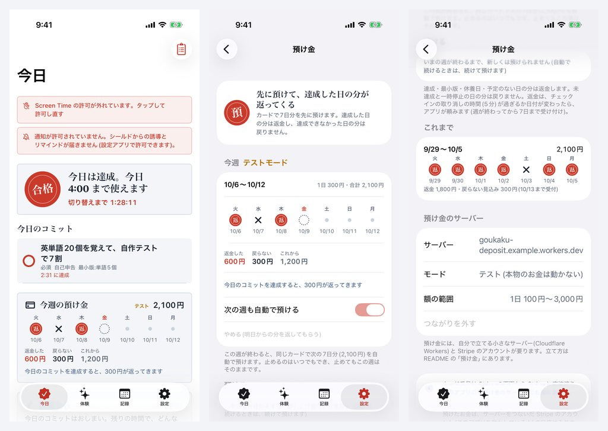

# 合格ロック(GoukakuLock)

自分で決めた試験(目標)を、毎日の習慣にするための iOS アプリ。決めた時刻に、お金を使うアプリ(決済・買い物)とアプリ内課金を止め、その日のコミットを達成したと記録すると外れます。ロックでお金が引かれることはなく、使えなくなるだけです。

**v2.0 から「相棒AI」が入りました。** iPhone の中だけで動くAIが、人生の中でどんな体験ができるかを一緒に考えます。義務ではなく体験として誘い、やってみたら書いたことにふれて返事をします。やるかどうかは、いつも本人が決めます。

**v2.1 で、AIの制限を外し、カードの「預け金」を足しました。**

- **AIに制限をかけない**:話す中身のフィルター・決まった言い回し・「〜しない」の決まりごとをすべて外しました。どのモデルも自分の言葉で、人と話すように話します([くわしく](#aiの話す中身はしばらないv21))
- **預け金(使うかは自由)**:カードで7日分を先に預け、達成した日の分が返ってきます。未達成の日の分は戻りません。お金は自分で立てるサーバー(Cloudflare Workers)と Stripe で動き、カード番号はアプリにもサーバーにも残りません([くわしく](#預け金v21))

設計は「合格ロック 完全仕様書(iOS)v3.0」のとおりで、このリポジトリはその**フェーズ1(MVP)とフェーズ2**(ドメインの直接指定を除く)に、相棒AIを足したものです。





スクリーンショットは CI の UI テストで撮ったもの(iPhone 17 シミュレータ・iOS 26.5)。シミュレータでは Screen Time の許可が得られないため、警告の帯が出ています。シミュレータでは MLX が動かないので、相棒AIの画面は「見本のAI」(Gemma 4 E2B の出力をもとにした決まった文を返す、Debug 版だけの仕組み)で動かしています。預け金の画面は、サーバーにつながない「見本の預け金」(Debug 版だけ)です。ウィジェットと Live Activity は、拡張と同じビューをアプリ内の見本画面(Debug 版)で描いたものです。

見た目は「答案用紙と赤ペン」:状態は丸い印(はんこ)1つで表し、達成は朱の ◯、最小版は △、未達成は ✕ で記録します。相棒の言葉は「余白の鉛筆の書き込み」(藍色)で書き、採点の赤ペンとは分けています。

## いまの状態(v2.1.0)

| 項目 | 状態 |
|---|---|
| 判定の芯 GoukakuCore | 単体テスト 73 件が通過(macOS + Xcode 26.6、Linux + Swift 6.3.3)。預け金で返す日の決まり(DepositRules)を含む |
| 相棒AIの芯 GoukakuAI | 単体テスト 58 件が通過(同上)。どのお願いにも「〜しない」などの決まりごとが入っていないことと、AIの書いたことを中身ではじかないことも確かめる |
| MLX の実行部 GoukakuAIMLX | CI の Mac(GitHub Actions・Apple M1 の仮想 GPU)で、4 つのモデルをアプリと同じコードで読み込み、提案・ふり返り・2 往復の会話が返ることを確認 |
| 預け金のサーバー server/ | 偽の Stripe を相手にした 15 件のテストが通過(Node 22)。Cloudflare の実行環境(wrangler dev)で起動し、本物の Stripe API まで届くことも確認 |
| iOS アプリ(本体+拡張4つ) | Xcode 26.6 / iOS 26.5 SDK でビルド成功(このリポジトリのコードの警告 0)。最低 iOS 18.0、iPhone 専用 |
| 画面の通し確認 | CI で iPhone 17 シミュレータ(iOS 26.5)を使い、はじめの設定(相棒AIを含む)→ ホームの「相棒から」→ チェックインと相棒のひとこと → はなまる → ホームの「今週の預け金」→ 体験タブ(提案・やってみた・返事・話す・いつか・育ち)→ 設定 › AI → 記録 → 設定 › 預け金 → 週のふり返りの手紙 → 緊急解除 → 一時停止まで動かしてスクリーンショットを残す |
| 実機 | **未確認**。iPhone での MLX の速さとメモリ、Apple Intelligence、アプリ内のダウンロード、同梱モデルのクローン、預け金(Stripe のテストモード)、そしてロックそのもの(Screen Time API)は実機で確かめる |
| SP-01(無料の Apple ID で使えるか) | **使えない**で確定。Apple の DTS が、Personal Team(無料)では Family Controls を使えないと回答している |

## 相棒AI(v2.0)

### できること

| どこで | できること |
|---|---|
| 体験タブ | いまの自分(使える時間・いる場所・調子)を選ぶと、合いそうな体験を 3 つ誘う。書いている途中から見える。「やってみる」「いつか」に入れる、👍/👎 で好みを伝える、自分で書いて入れる。カードには出どころ(相棒・体験帳・自分で)を書く |
| 体験タブ › やってみた | 一言(書かなくてもいい)と気持ちを残すと、相棒が書いたことの具体的なところにふれて返事をし、問いを 1 つ添える |
| 体験タブ › 相棒と話す | 何でも話せる。どんな体験をしてみたいかも、話しながら一緒に考える(AIのモデルか Apple Intelligence があるとき) |
| 体験タブ › いつかの体験 | 人生のどこかで味わってみたいことを集める。期限はつけず、最初の一歩だけを今日の「やってみる」に入れられる。続けたくなったら、任意のコミットの下書きにもできる |
| 体験タブ › 育ち | 体験の地図(学ぶ・からだ・つくる・ひと・そと・こころ・くらし・はじめて の 8 区画)と、相棒の理解(はじめまして → 知りはじめ → 顔なじみ → 相棒)。**相棒の気づき**:やってみた体験が 3 つたまると、記録(種類・気持ち・書いたこと)から相棒が気づいたことを書き、まだの区画の体験を 1 つ誘う(頼んだときだけ)。相棒が覚えていることは本人が見て、消せる |
| ホーム | 「相棒から」:今日のコミットを、やらされる作業ではなく、ちょっと楽しみな体験にする工夫を聞ける |
| チェックインのあと | 書いた一言にふれて、相棒がひとこと返す(設定 › AI で止められる) |
| 週のふり返り | その週の体験から、相棒が手紙を書く |
| はじめの設定 | 相棒AIの説明と、この iPhone で使うAI(おすすめのモデルのダウンロード)、「あなたのこと」(任意) |

使うほど、相棒とあなたが一緒に育ちます。体験するほどあなたの地図が埋まり、覚えてもらう・👍/👎 をつけるほど相棒の提案があなたに合っていきます(覚えていること・好きだった体験・合わなかった体験・続けていることを、毎回プロンプトに入れます)。「相棒の気づき」は、その2つが重なったところに書かれます。

### 大事にしていること

- 決めるのは本人。アプリが目標を勝手に決めたり、採点したりはしない。AIが「覚えておきたい」と言ったことも、本人が「覚えてもらう」を押したときだけ覚える
- **AIの話す中身はしばらない**(下の「AIの話す中身はしばらない」)
- AIはこの iPhone の中だけで動く。書いたことはどこにも送らない。通信するのはモデルをダウンロードするときだけ(Hugging Face から公開のファイルを取るだけ)
- ロックの安全の床(緊急解除・一時停止・やめる合図)はそのまま。相棒AIはロックに関わらない

### AIの話す中身はしばらない(v2.1)

v2.0 までは、AIの答えをアプリの側で細かくしばっていました(お金・お酒・食事などの言葉が入った提案をはじく、夜に家にいる人には出かける提案を出さない、小さいモデルは体験帳の体験に一文を添えるだけ、ひとことは「〜かも」で終える、プロンプトに「〜しない」「〜は避ける」を並べる)。しばるほど話し方に変な癖がつき、人と自然に話せなくなるので、v2.1 ですべて外しました。

| | v2.0 | v2.1 |
|---|---|---|
| 役割の説明(system) | 4 文。「〜は使わず」「お金がかからず、安全で」「絵文字は使いません」など | 1 文だけ:「あなたは、この人の相棒です。この人が人生の中でどんな体験ができるかを一緒に考えながら、思ったことを自分の言葉で自由に話します。」 |
| 中身のフィルター | 禁止語(買・お酒・ダイエット など 53 語)が入った答えは捨てる | なし |
| いまの様子とのずれ | 夜・家にいる人への「カフェ」「公園」などは捨てる | なし(いまの様子は伝えるだけで、どう受けとるかは AI が決める) |
| 小さいモデルの提案 | 体験帳の体験に、AI が「〜かも」で終わる一文を添えるだけ | 大きいモデルと同じく、自分で考える |
| 形が崩れた答え | 作り直し、だめなら体験帳に置きかえる | 1 回だけ作り直してもらい、それでも見出しがなければ、書いたことをそのままカードにする |
| 相棒と話す | 「2〜4 文で」「専門家に相談するよう伝える」など。返事は約 260 トークンまで | 決まりごとなし。返事は約 800 トークンまで。会話を覚えている長さものばす(小さいモデルで 3→6 往復、大きいモデルで 6→10 往復) |
| 言葉 | 日本語でない答えは捨てる | 英語で話しかければ英語でも返す |
| Apple Intelligence | 標準のガードレール | いちばんゆるいガードレール(`permissiveContentTransformations`) |

残っているのは、画面に並べるための形(提案のカードの「体験:/ひとこと:/はじめ方:/時間:/種類:」と、ふり返りの「返事:/問い:/メモ:」の見出し)と、モデルそのものが学習で身につけている判断だけです。会話の 1 往復目を「答え方の手本」と取りちがえて、同じ形でしか返さなくなっていた不具合も直しました。

### 完全環境適応(どのAIで動くかは、端末が決める)

相棒の「頭」は 3 種類あり、端末の様子を見て自動で選び、様子が変わるたびに選び直します。設定 › AI に、選んだ理由と、選ばなかったモデルとその理由がそのまま出ます。

1. **この iPhone に入っている MLX のモデル**:メモリに収まるもののうち、日本語が一番自然なもの
2. **Apple Intelligence**(iOS 26 以降・オンのとき):ダウンロード不要
3. **体験帳**(AIなし):96 の体験と、ルールで書く返事・手紙。どの端末でも必ず動く

| 見ているもの | どう変わるか |
|---|---|
| アプリが使えるメモリ(`os_proc_available_memory`) | 動かすのに要るメモリの見込みが、使える量の 9 割を超えるモデルは使わない |
| 熱 | 熱いときは返事を短く・軽いモデルを先に。とても熱いときは AI を休ませて体験帳に |
| 低電力モード | 返事を短く。Apple Intelligence が使えればそちらを先に |
| Apple Intelligence の状態 | 使えるときだけ候補に入れる(非対応・オフ・準備中を見分けて表示) |
| モデルの大きさ | 小さいモデルほど、プロンプトに入れる文脈と会話を覚えている長さを少なくする(メモリと速さのため。話す中身は変えない) |
| 読み込み中にアプリが終了したモデル | 次からは休ませる(落ち続けない)。設定 › AI から戻せる |
| 裏に回った・メモリの警告 | 20 秒たったら(警告ならすぐ)モデルを手放し、使うときに読み込み直す |
| GPU | Metal 3(A13 以降)でなければ MLX は使わない |
| アプリが前から外れる | 生成をすぐ止める(iOS は裏で GPU を使えないため)。ふり返りは体験帳の返事で補い、提案はもう一度押せば続きを考える |
| シミュレータ | MLX は動かないので使わない |

提案とふり返りは、画面に並べるために手本を 1 往復だけ見せ、1 回に 1 つずつ頼みます。体験帳で補うのは、AIが動かないとき(モデルが入っていない・読み込めない・とても熱い)と、AIが同じ体験をくり返したときだけです。

### ライブラリ:MLX(mlx-swift-lm)を選んだ理由

iPhone 17 Pro での生成の速さ(毎秒のトークン数。[apple-silicon-llm-bench](https://github.com/john-rocky/apple-silicon-llm-bench) の実測):

| モデル | MLX-Swift | llama.cpp | Core ML(ANE) | Core AI | LiteRT-LM |
|---|---|---|---|---|---|
| Qwen3.5 2B(iOS 26.4.2) | **61.2** | 39.1 | 27.9 | — | — |
| Gemma 4 E2B(iOS 27.0) | 49.1 | 38.8 | — | 47.1 | **61.1**(公式の QAT ビルド) |

- いろいろな系統のモデル(Gemma 4・Qwen3.5・LFM2.5・Llama・Mistral・Phi など)を、1 つの仕組みで速く動かせるのが MLX。Swift のパッケージとして組み込め、iOS 18 から動く
- Gemma 4 E2B だけなら、Google の LiteRT-LM の公式ビルドが速く、メモリも小さい(約 0.5GB。MLX は約 3GB)。ただ対応するモデルが限られ、Swift からそのまま使える形がないので、今回は見送り
- Core AI は出たばかり(iOS 27 から・iOS では文脈の長さに上限・書き出しで遅くなる不具合の報告)なので見送り。iOS 27 の Foundation Models に MLX・Core AI 用の差し込み口ができたので、育ったら乗りかえやすい
- AIを動かす部分は差し替えられる作り(GoukakuAI の `LanguageEngine`)。エンジンを 1 つ足せば、提案・ふり返り・会話・体験帳での補いはそのまま使える

### 使えるモデル(AI/models.json)

| モデル | 日本語 | 速さ | 入れたあと | ダウンロード | 動かすのに | おすすめのメモリ | ライセンス |
|---|---|---|---|---|---|---|---|
| Gemma 4 E2B | ●●●●● | ●●●●○ | 2.5GB | 3.3GB | 約 2.9GB | 8GB 以上 | Apache 2.0(Gemma 4) |
| LFM2.5 1.2B JP | ●●●○○ | ●●●●● | 0.6GB | 0.6GB | 約 0.9GB | 4GB 以上 | LFM Open License v1.0 |
| Qwen3.5 4B | ●●●○○ | ●●○○○ | 2.2GB | 2.8GB | 約 2.7GB | 8GB 以上 | Apache 2.0 |
| Qwen3.5 2B | ●●○○○ | ●●●●● | 1.0GB | 1.6GB | 約 1.4GB | 6GB 以上 | Apache 2.0 |

- どれも MLX 形式の 4bit。Hugging Face のリビジョン(コミット)を固定して、毎回同じ中身を取る
- 画像・音声の部分(`vision_tower` など)は取り除き、文章に使う部分だけを入れる(Gemma 4 E2B は 3.3GB → 2.5GB)
- 「日本語」は、同じプロンプトで 4 つを動かして読み比べた印象。自動で選ぶときは、動かせるもののうちこれが高いもの(同じなら軽いもの)を使う

CI の Mac(GitHub Actions・Apple M1 の仮想 GPU)で、アプリと同じ MLXEngine・v2.1 の制限のないプロンプト・同じ様子(金曜の夜・家・少し疲れている・15 分)で動かし、提案 3 つ・ふり返り・2 往復の会話(「最近ちょっと疲れてて、何もやる気が出ないんだよね」「じゃあ、今夜なにしたらいいと思う?」)を見た結果:

| モデル | 読み込み | 生成の速さ | 会話の温度 | 出力の印象 |
|---|---|---|---|---|
| Gemma 4 E2B | 14 秒 | 毎秒 20 | 0.8 | 人と話すように自然。気持ちを受けとめてから、選択肢を並べて聞き返す。絵文字も使う。提案も自分の言葉で誘う |
| LFM2.5 1.2B JP | 3 秒 | 毎秒 48〜54 | 0.3 | 速い。作った人のおすすめの温度(0.3)にすると、会話の筋が通る(0.8 では話がそれた)。提案は素直で、似た体験が並ぶことがある |
| Qwen3.5 4B | 21 秒 | 毎秒 13 | 0.7 | ふり返りと会話は自然。ときどき中国語の語尾や不思議な言い回しがまじる |
| Qwen3.5 2B | 7〜13 秒 | 毎秒 32〜39 | 0.7 | 提案とふり返りはおおむね自然。会話は長くなると話が飛びやすい。同じ行をくり返しはじめたら、そこで止める |

仮想 GPU での数字なので、速さは iPhone の実測(上の表)とは別物で、実行ごとのぶれも大きいです。読み込みは初回だけで、そのあとはアプリが裏に回るまで持ち続けます。「会話の温度」は、会話・手紙・気づきを書くときの温度(モデルを作った人のおすすめが目録にあればそれ)で、話す中身はしばりません。

Gemma 4 E2B が CI で返したもの(そのまま):

> **提案**:感謝の「音」を聴く ― 静かに深呼吸をして、今の自分に感謝の気持ちを声に出してみましょう。(はじめ方:静かな部屋で目を閉じ、心の中で「ありがとう」と呟く・15 分・こころ)<br>
> **提案**:散歩の「名前」の歴史を探る ― ただ歩くだけでなく、その場所や風景に込められた言葉の背景を知ることで、散歩が変わるんですよ。(15 分・学ぶ)<br>
> **ふり返り**(「夕焼けを見に屋上へ」に「空がオレンジから紫に変わるのを10分見ていた。風が気持ちよかった。」と書いたとき):夕焼けのグラデーションと風の感覚をそのまま言葉にしたところに、心が洗われるような、穏やかな体験が伝わってきます。ただ美しいだけでなく、五感で味わった「おだやかさ」が素晴らしいですね。<br>
> **会話**(「最近ちょっと疲れてて、何もやる気が出ないんだよね」):うーん、そうなんだね。最近ちょっと疲れちゃったんだ。心が充電切れちゃったって感じかな？😔 無理に何かを頑張ろうとしなくても大丈夫だよ。たまには、何も考えずにぼーっとする時間も大事だと思うんだ。(中略)散歩が好きって言ってたから、もしよかったら、今からでも、ちょっとだけ気分転換にいい空気吸いに行く？

### AIの入れ方(3 通り)

1. **アプリの中でダウンロード**(おすすめ):設定 › AI(またははじめの設定の「相棒AI」)で選ぶ。初回だけ通信し、あとは通信なしで動く。止めても取り終えたファイルから続け、通信が切れたらそのファイルの途中から最大 3 回つなぎ直す。取り終えたら合計の大きさを目録と照らし合わせてから入れる。アプリを上書きでインストールしても消えない(iCloud のバックアップには入れない)
2. **ファイルから取り込む**:MLX 形式のモデルのフォルダ(`config.json`・`tokenizer.json`・`*.safetensors`)を、設定 › AI のファイル App から選ぶか、Mac の Finder やファイル App で「この iPhone 内 › 合格ロック › AIModels」に置く(次に開いたときに取り込む)。目録にないモデルも、MLX が読める形式(Gemma・Qwen・LFM2・Llama・Mistral・Phi など)なら使える
3. **モデル入りの IPA**:`GoukakuLock-AI-<モデル>.ipa` を入れる。最初から通信なしで使える。起動するとアプリの外にもモデルを残す(APFS のクローンなので容量は増えない)ので、そのあとは AIなし版で上書きしてもモデルは消えない(クローンできない端末では、同梱のまま使う。設定 › AI のモデルの欄に、どちらかが出る)

## 預け金(v2.1)

使うかどうかは自由です。使わなければ、アプリはいままでどおり(サーバーにもつなぎません)。

### しくみ

カードで 7 日分を先に預け(1日 100〜3,000円から選ぶ。サーバーの設定で変えられる)、明日の日付切替から 7 日間、その日の結果で返すかどうかが決まります。どの日を返すかは、アプリの判定(履歴の ◯△✕ と同じ)をそのまま使います。

| その日の結果 | 預けた分 | 返金を頼むとき |
|---|---|---|
| 達成(◯)・最小版(△) | 返ってくる | チェックインの取り消しの時間(5 分)が過ぎたら、日付が変わる前でも |
| 休養日・予定のない日 | 返ってくる | 日付が変わったら |
| 未達成(✕)・一時停止 | 戻らない | — |

- 返金はアプリがサーバーに頼み、サーバーが Stripe で返します。カードに戻るまで数日〜2週間ほど(カード会社しだい)
- 圏外だった日などのために、週が終わってから 7 日間は遅れた知らせも受け付けます。過ぎたら、戻らない額が決まります
- **次の週も自動で預ける**(はじめはオン):週が終わると、同じカードで次の 7 日分を預けます(サーバーが 15 分ごとに見回る)。止めるのはいつでもでき、止めてもいまの週はそのままです。カード会社の本人確認(3D セキュア)が要るときなど自動で預けられなかったら、ホームと設定に出るので、アプリで預け直します
- **やめる**(やめる合図):設定 › 預け金 の「やめる」で、明日からの分を返してもらい、次の週も預けなくなります。今日までの分は、これまでどおり結果しだいです(ロックの「ゆるめる変更は翌日から」と同じ考え)
- 戻らなかったお金は、サーバーをつないだ Stripe のアカウントの口座に入ります(自分で立てたなら、自分の口座)

### 守っていること

- カード番号は、アプリの中の Stripe の支払い画面(PaymentSheet)から Stripe に直接渡り、アプリにも預け金のサーバーにも残りません
- サーバーは台帳を持ちません。預けた支払い(PaymentIntent)と返金(Refund)そのものが記録で、「同じ日は二度返さない」「預けた額を超えて返さない」「始まっていない日は返さない」「ほかの人の預け金にはさわれない」をサーバーが確かめます
- サーバーに渡るのは「日付と、その日の結果(達成・休養日など)」だけです。書いた一言・コミットの名前・写真は送りません。端末の合い言葉はキーチェーン(この iPhone だけ)に置きます
- ロックの非常口(緊急解除・一時停止)は、預け金があってもいままでどおり使えます(一時停止の日の分は戻りません。ストリークと同じ扱い)

### 預け金のサーバーを立てる(Mac は要りません)

要るもの:[Stripe](https://dashboard.stripe.com/register) のアカウント(テストモードなら、審査なしですぐ使える)、[Cloudflare](https://dash.cloudflare.com/sign-up) のアカウント(Workers の無料枠で足りる)、このリポジトリ。

1. **Stripe**:ダッシュボード › 開発者 › API キー で、公開可能キー(`pk_test_…`)とシークレットキー(`sk_test_…`)を控える。はじめはテストモードで
2. **Cloudflare**:My Profile › API Tokens で「Edit Cloudflare Workers」のテンプレートからトークンを作る。アカウント ID も控える
3. **GitHub**:リポジトリの Settings › Secrets and variables › Actions に入れる
   - Secrets:`CLOUDFLARE_API_TOKEN`・`CLOUDFLARE_ACCOUNT_ID`・`STRIPE_SECRET_KEY`・`DEPOSIT_TOKEN_SECRET`(長いランダムな文字列。例:`openssl rand -hex 32`)
   - Variables:`STRIPE_PUBLISHABLE_KEY`、(任意)`DEPOSIT_REGISTRATION_CODE`(招待コード。決めると、コードを知っている人だけが登録できる)
4. Actions › **Deposit server** › Run workflow で `deploy` にチェック → テストを通ってから Cloudflare Workers に出る。URL は `https://goukaku-deposit.<サブドメイン>.workers.dev`
5. アプリの 設定 › 預け金 に URL を入れて「つなぐ」。(任意)Variables に `DEPOSIT_SERVER_URL` を入れておくと、次から CI が作る IPA に最初から入る

手元から出すときは:`cd server && npx wrangler login && npx wrangler secret put STRIPE_SECRET_KEY && npx wrangler secret put TOKEN_SECRET && npx wrangler deploy --var STRIPE_PUBLISHABLE_KEY:pk_test_…`

**テストモードで試す**:お金は動きません。カード番号 `4242 4242 4242 4242`(期限は未来の日付、セキュリティコードは好きな 3 桁)で預けられます。`4000 0027 6000 3184`(いつも本人確認が要るカード)で預けると、週が終わったときに「自動では預けられませんでした」の流れも試せます。返金は Stripe のダッシュボード(テストモード)の「支払い」に 1 日ずつ並びます。

**本番にする**:Stripe のアカウントを有効にして(本人確認・入金先の口座)、本番のキー(`pk_live_…`・`sk_live_…`)に入れかえ、もう一度 Deploy。アプリの 設定 › 預け金 に「本番」と出ます。

- Stripe の決済手数料(国内カードは 3.6% など。最新は Stripe の料金ページで)は預けた額にかかり、Stripe の口座の持ち主が払います。返金しても戻りません。自分だけで使うなら、手数料のぶんだけ自分の負担になります
- ほかの人にも配って預け金を受けるなら、事業として扱われます。特定商取引法に基づく表記・利用規約・返金の決まりを用意し、Stripe の利用規約(制限のある業種)に当たらないか、1日の額がどこまでなら妥当か(消費者契約法の違約金の考え方など)を、専門家に確かめてからにしてください

### サーバーの窓口(server/src/index.js)

| | |
|---|---|
| `GET /v1/config` | 公開鍵・額の範囲など(秘密の鍵は出さない) |
| `POST /v1/register` | 端末を登録して合い言葉(Stripe の客の id + 署名)を受け取る |
| `GET /v1/state` | 最近の週の様子(日ごとの返金・戻らない額) |
| `POST /v1/deposits` | 7 日分の支払いを作る(アプリが Stripe の画面で払う) |
| `POST /v1/deposits/:id/days/:day` | その日の結果を知らせる(返す結果なら、その日の分を返金) |
| `POST /v1/deposits/:id/renew` | 次の週も自動で預けるか |
| `POST /v1/deposits/:id/cancel` | やめる(まだ始まっていない日の分を返し、自動で続けるのも止める) |
| Cron(15 分ごと) | 週が終わった預け金を、保存したカードで次の週へ |

## ダウンロード

`main` に push するたびに GitHub Actions がビルドします。モデル入りの IPA は、Actions の「Run workflow」(`models` に `all` かモデルの id)か、`v` で始まるタグを push したときに、モデルごとに並べて作ります。どのモデルも、IPA に入れる前に MLX で実際に読み込んで日本語が返ることを確かめています(各実行の Summary に結果が出ます)。

| ファイル | 中身 | 大きさ |
|---|---|---|
| `GoukakuLock-Release.ipa` | ふだん使う版(AIなし。モデルはアプリでダウンロードか取り込み) | 約 21MB |
| `GoukakuLock-Debug.ipa` | デバッグメニューつき。実機テスト(仕様書 第19.3節の T-01〜T-12)用 | 約 33MB |
| `GoukakuLock-AI-gemma4-e2b.ipa` | Gemma 4 E2B 入り(Release 版) | 約 2.2GB |
| `GoukakuLock-AI-lfm2.5-1.2b-jp.ipa` | LFM2.5 1.2B JP 入り(Release 版) | 約 0.6GB |
| `GoukakuLock-AI-qwen3.5-4b.ipa` | Qwen3.5 4B 入り(Release 版) | 約 2.0GB |
| `GoukakuLock-AI-qwen3.5-2b.ipa` | Qwen3.5 2B 入り(Release 版) | 約 0.9GB |

- **Actions の Artifacts**:各実行の `GoukakuLock-ipa-<番号>`(AIなし版)と `GoukakuLock-AI-<モデル>-<番号>`(モデル入り。90 日残る)
- **Releases**:タグを push したとき、または「Run workflow」で `release_tag` を入れたとき。GitHub の Releases は 1 ファイル 2GiB までなので、超える IPA は `.ipa.part-aa`・`.ipa.part-ab` に分けて置いています。つなげ方:
  - Mac・Linux:`cat GoukakuLock-AI-gemma4-e2b.ipa.part-* > GoukakuLock-AI-gemma4-e2b.ipa`
  - Windows:`copy /b GoukakuLock-AI-gemma4-e2b.ipa.part-aa + GoukakuLock-AI-gemma4-e2b.ipa.part-ab GoukakuLock-AI-gemma4-e2b.ipa`
  - つないだら `SHA256-<モデル>.txt` と照らし合わせる(`shasum -a 256 <ファイル>`、Windows は `certutil -hashfile <ファイル> SHA256`)

IPA の中には 5 つのバンドルがあります:本体、`GoukakuMonitor`・`GoukakuShieldConfig`・`GoukakuShieldAction`(Family Controls を使う拡張)、`GoukakuWidget`(ウィジェット・Live Activity・コントロール。App Groups だけ)。本体の `Frameworks/` には、預け金の支払い画面に使う Stripe のフレームワーク(エンタイトルメントなし)が入っています。モデル入りの IPA は、本体の中の `AIModels/<モデル>/` にモデルが入っています。

どれも**未署名**(証明書なしのアドホック署名で、必要なエンタイトルメントだけが入っている)です。このままでは iPhone に入りません。

## 実機に入れる(署名)

### 必要なもの

- 有料の Apple Developer Program(無料の Apple ID では Family Controls を使えません)
- iOS 18.0 以上の iPhone。相棒AIのモデルは、メモリ 4GB 以上なら LFM2.5 1.2B JP、8GB 以上なら Gemma 4 E2B がめやす。足りない端末でも、Apple Intelligence か体験帳で動きます

自分の iPhone に開発用として入れるだけなら、Family Controls の配布用(Distribution)の申請は要りません。ほかの人に配るなら、4つの Bundle ID それぞれについて申請が要ります(仕様書 第3.3節)。

### 1. Apple Developer のサイトで準備する(Mac は不要)

[Certificates, Identifiers & Profiles](https://developer.apple.com/account/resources/) で次を作ります。

1. **App Group**:`group.com.aokijp.goukakulock`
2. **App ID を5つ**。下の表の Capabilities をオンにし、App Groups には 1 の App Group を割り当てる

   | バンドル | Bundle ID | Capabilities |
   |---|---|---|
   | 本体 `GoukakuLock.app` | `com.aokijp.goukakulock` | Family Controls・App Groups・Increased Memory Limit |
   | `PlugIns/GoukakuMonitor.appex` | `com.aokijp.goukakulock.monitor` | Family Controls・App Groups |
   | `PlugIns/GoukakuShieldConfig.appex` | `com.aokijp.goukakulock.shieldconfig` | Family Controls・App Groups |
   | `PlugIns/GoukakuShieldAction.appex` | `com.aokijp.goukakulock.shieldaction` | Family Controls・App Groups |
   | `PlugIns/GoukakuWidget.appex` | `com.aokijp.goukakulock.widget` | App Groups |

   Increased Memory Limit は、相棒AIが大きめのモデルを読み込むためのもの(特別な申請は要りません)。なくても動きますが、使えるメモリが減るぶん、選ばれるモデルが小さくなることがあります

3. **Apple Development の証明書**(秘密鍵と合わせて `.p12` に書き出す)
4. **デバイス**(iPhone の UDID)の登録
5. **Development のプロビジョニングプロファイルを5つ**(上の App ID ごとに1つ)

Bundle ID を自分のものに変える場合は、拡張の ID を「本体の ID + `.monitor` など」にしてください。App Group の ID は、アプリが署名に使われたプロファイルから実行時に読み取るので、5つのプロファイルが同じ App Group を含んでいれば、ID を変えても動きます。

### 2. 署名し直す

5つのバンドルに、それぞれ対応するプロファイルを当てて署名します。例として、Linux・Windows・macOS で動く [zsign](https://github.com/zhlynn/zsign) なら、拡張の分も `-m` を重ねて渡せます。モデル入りの IPA も同じやり方です(大きいので、数十秒〜数分かかります)。

```sh
zsign -k dev.p12 -p 'p12のパスワード' \
  -m goukakulock.mobileprovision \
  -m monitor.mobileprovision \
  -m shieldconfig.mobileprovision \
  -m shieldaction.mobileprovision \
  -m widget.mobileprovision \
  -o GoukakuLock-signed.ipa GoukakuLock-Release.ipa
```

署名後、本体と3つの拡張に `com.apple.developer.family-controls` と `com.apple.security.application-groups` が、ウィジェットに `com.apple.security.application-groups` が残っていることを確かめてください。どれか1つでも欠けると、そのバンドルは動きません。本体の `com.apple.developer.kernel.increased-memory-limit` は、プロファイルに入っていれば残ります(なくても動きます)。

### 3. インストールする

署名済みの IPA は、署名をし直さずに入れる方法で入れます(例:zsign の `-i`(内部で ideviceinstaller を使う)、ideviceinstaller、Apple Configurator など)。署名をし直す種類のツールで入れると、拡張ごとのプロファイルが外れることがあります。

### Mac がある場合

```sh
brew install xcodegen
xcodegen generate     # project.yml から GoukakuLock.xcodeproj を作り直す
open GoukakuLock.xcodeproj
```

各ターゲット(本体と拡張4つ)の Signing & Capabilities で自分の Team を選べば、自動署名が App ID とプロファイルを作ります。iPhone をつないで Run すれば入ります。MLX は Metal を使うので、Xcode 26 では `xcodebuild -downloadComponent MetalToolchain` で Metal のツールを入れておきます。

## 最初に確かめること(実機)

Debug 版を入れて、仕様書 第20章のスパイクのうち SP-02〜SP-08・SP-10・SP-14 を先に確かめてください。手順は第19.3節の T-01〜T-12 で、デバッグメニュー(設定 › デバッグメニュー)を使います。

- **T-01**:日付切替を「今から20分後」に合わせ、端末をロックして待つ → 切替後に対象アプリを開くとシールドが出る → 本体でチェックインすると開ける
- **T-03**:「緊急解除を短くする」をオンにして申請 → 待機中はシールド、解除中は開ける、終了後は本体を閉じたままでもシールドに戻る
- **T-05**:「ロックを外す(判定はそのまま)」→ 対象アプリを1分以上使う → トリップワイヤーでロックが戻る

相棒AIは次の順に確かめます(デバッグメニューの「いまのAIの様子」に、選んだAI・理由・メモリ・速さが出ます)。

- **AI-1**:設定 › AI で、選ばれたAIと理由を見る → 体験タブで「体験を3つ見つける」→ 書いている途中の文が出て、カードが 3 つ並ぶ
- **AI-2**:メモリ 8GB 以上なら Gemma 4 E2B、それより少なければ LFM2.5 1.2B JP をダウンロード → 機内モードにして、提案・やってみた・相棒と話すが動く
- **AI-3**:モデル入りの IPA を入れて一度起動 → AIなし版で上書きでインストール → 設定 › AI にモデルが「IPA から残したもの」として残っている
- **AI-4**:相棒と話したあとホームに戻り、20 秒以上待ってから戻る → 次に使うときに読み込み直す(裏ではメモリを手放している)
- **AI-5**:提案を作っている途中でホーム画面に戻る → アプリは落ちず、戻ると「途中で止めました」と出る(iOS は裏で GPU を使えないので、前から外れる前に止めている)
- **AI-6**:メモリ 4〜6GB の iPhone で LFM2.5 1.2B JP を入れる → 提案のカードに「相棒」と出て、AI が自分で考えた体験が並ぶ
- **AI-7**:モデルのダウンロード中に Wi-Fi を一度切ってつなぎ直す → 「つなぎ直し」と出て、途中から続く
- **AI-8**:相棒と話すで、何往復か雑談する → 決まった形(「返事:」など)に引きずられず、前の話を覚えたまま自然に返る

預け金は、テストモードのサーバーで確かめます(お金は動きません)。

- **DEP-1**:設定 › 預け金 にサーバーの URL を入れて「つなぐ」→「テスト(本物のお金は動かない)」と出る → 1日 300円で預ける(カード `4242 4242 4242 4242`)→ ホームに「預け金(明日から)」が出る
- **DEP-2**:次の日、チェックインして 5 分待つ(アプリは開いたまま)→ その日の印が「返」(塗り)になり、Stripe のダッシュボードに 300円の返金が出る
- **DEP-3**:チェックインしなかった日 → 日付が変わると ✕(戻らない)
- **DEP-4**:機内モードのまま達成して日付をまたぐ → 機内モードを切ってアプリを開くと、その日の分が返金される
- **DEP-5**:`4000 0027 6000 3184` で預け、週が終わるまで待つ → 「自動では預けられませんでした」と出て、預け直せる
- **DEP-6**:週の途中で「やめる」→ 明日からの日が「返」になり、今日は「今日」のまま(達成すれば返る)。次の週は預けない

## ロックまわり(v1.1 まで)

### アプリだからできること

| どこから | できること |
|---|---|
| ホーム画面・StandBy | ウィジェット(小・中):今日の印、残り時間、連続日数、今日のコミットの ◯/未、直近7日。タップでチェックイン画面 |
| ロック画面 | ウィジェット(円・長方形・1行):ロック中か、残り時間、今日の進み |
| ホーム画面のアイコン | 長押しで「チェックイン」「集中タイマー」(クイックアクション) |
| コントロールセンター・アクションボタン | 「合格ロックでチェックイン」ボタン |
| 通知 | リマインドやシールドの通知を長押しして、一言(5文字以上)書けばアプリを開かずに記録。最小版でも記録できる |
| Siri・ショートカット | 「合格ロックでチェックイン」「合格ロックの今日の状態」「合格ロックで集中タイマー」 |
| Dynamic Island・Live Activity | 緊急解除(待機と残り)、集中タイマー、稼働型の解除枠の残り時間 |

### 確かめ方(仕様書 フェーズ2)

- **自己申告**:一言 5 文字以上(フェーズ1)
- **集中タイマー**:アプリを前に出している時間だけを数える。離れると一時停止、厳格モードなら 0 から。実行中は画面を点けたまま
- **写真**:アプリ内のカメラで撮ったものだけ(ライブラリからは選べない)。位置情報は残さず、90 日で消す
- **使用時間(自動)**:選んだ学習アプリをその日に合計 N 分使うと、アプリを開かなくても自動で達成(DeviceActivity のしきい値)
- **稼働型**:いつもはロックし、計れる方法でチェックインするたびに決めた時間だけ外れる(バイト感覚)

### 続けたくなる工夫

- 節目(はじめての達成、連続 3・7・14・21・30・50・100… 日)に、赤ペンの「はなまる」を描くお祝いと触覚
- 合格証の画像をシェア(載せるのは連続・通算と、本人が選んだときだけ目標の名前)
- はじめて合格したあと、ウィジェットをまだ置いていなければ、ホームに一度だけ置き方の案内(置けば消える・閉じたら二度と出ない)
- 連続 7・30・100 日で解放される別アイコン(墨・金・桜)
- 目標の例から選べる(英単語・過去問・集中勉強・読書・語学アプリ・筋トレ・楽器・プログラミング)
- この2週間の ◯△✕、週に1回のふり返り(3つだけ)、2週間続いたら「一段上げる」の提案(提案だけ)
- 3日続けて未達成なら、追い込まずに「下げる・休む・止める」を並べる(フェーズ1から)

安全の床(緊急解除・一時停止・やめる合図)はそのまま。ロックでお金を取ることはなく、お金がかかわるのは、本人が選んだ預け金だけです。

### 実装したもの(フェーズ1)

- S-01 はじめの設定(v2.0 で相棒AIの手順を足して 9 手順)、S-02 ホーム、S-03 チェックイン(5分以内の取り消し)、S-04 コミット(必須3つまで)、S-05 記録(◯△✕のカレンダー)、S-06 設定、S-07 緊急解除、S-08 一時停止・見守り・卒業の提案
- 設定を緩められない仕組み(第7.5節):緩める変更は達成後だけ受け付けて翌サイクルから
- 起動・前面復帰・バックグラウンド更新の処理(第16.4節)、再インストールと時刻改ざんの検知、共有ファイルの復旧
- デバッグメニュー(Debug 版だけ):日付切替を任意の時刻に、緊急解除を短く、見本(ウィジェット・Live Activity・お祝い)、見本のAI など

### まだないもの

執行役(CloudKit での共有・承認)・帳簿・ヘルスケア・場所つきタイマー(以上フェーズ3)。判定の芯はこれらにも対応済みです。

フェーズ2のうち「ドメインの直接指定」だけは入れていません。仕様書の SP-12 のとおり、iOS 26.6 で指定外のサイトまで止まる報告があり、Safari のプライベートブラウズも使えなくなるため、実機で確かめてから足します(買い物サイトは、ロック対象の選択画面でサイトとして選べば止まります)。

## データ

- すべてこの iPhone の中(SwiftData と App Group のファイル)。どこにも送りません
- 相棒AIの記録(やってみた体験・相棒の返事・覚えていること・会話)も同じ。設定の「データを書き出す」に入り、「すべてのデータを消す」で消えます
- 入れたモデルは「すべてのデータを消す」では消えません(設定 › AI で 1 つずつ消せます)
- 預け金を使うときだけ、自分で立てたサーバーと Stripe に「日付と、その日の結果(達成・休養日など)」を送ります。カード番号は Stripe だけが持ち、アプリとサーバーには残りません。端末の合い言葉はキーチェーンに置き、設定 › 預け金 の「つながりを外す」で消えます

## 開発

```
GoukakuCore/      判定の芯と、状態の言い方・預け金で返す日の決まり(Foundation だけ。swift test で単体テスト 73 件)
GoukakuAI/        相棒AIの芯(Foundation だけ。Linux でも swift test で単体テスト 56 件):
                  モデルの目録・使うAIの選び方・プロンプト・出力の読み取り・体験帳(96 の体験)・育ち・safetensors の軽量化
GoukakuAIMLX/     MLX でモデルを動かす部分(mlx-swift-lm 3.32.3・swift-transformers 1.3.4)と、実際のモデルで確かめるテスト
GoukakuKit/       GoukakuShared:App Group・ディープリンク・ウィジェット用の数字・Live Activity の型
                  GoukakuKit:ManagedSettings・DeviceActivity・FamilyControls・通知のつなぎ
Extensions/       Monitor・ShieldConfig・ShieldAction の各拡張
Widgets/          ウィジェット拡張(Extension/)と、本体の見本でも使うビュー(Views/)
Shared/UI/        見た目(印・採点の記号・はなまる・色)。本体とウィジェットで共有
App/              本体アプリ(SwiftUI + SwiftData + App Intents + ActivityKit)
App/AI/           相棒AI:使うAIを決めて動かす(AIRuntime)・モデルの出し入れ・Apple Intelligence・体験と記録(CompanionModel)
App/Views/AI/     体験タブ・相棒と話す・いつかの体験・育ち・設定 › AI
App/Deposit/      預け金:サーバーとのやりとり・返金の知らせ・Stripe の支払い画面(DepositModel)
App/Views/Deposit/  設定 › 預け金・ホームの「今週の預け金」
server/           預け金のサーバー(Cloudflare Workers・依存なしの JavaScript)。npm test で、偽の Stripe を相手に 15 件のテスト
AI/models.json    使えるモデルの目録(CI とアプリが同じものを読む)
UITests/          シミュレータで画面を一通り動かしてスクリーンショットを残すテスト
project.yml       XcodeGen の定義(GoukakuLock.xcodeproj はここから生成)
scripts/          IPA に包む・モデルを取る(fetch-model.py)・画面の通し確認(ui-walkthrough.sh・launch-probe.sh)・README の画像を作る(compose-screens.py)
.github/workflows/build.yml     CI(テスト → ビルド → AIなし版の IPA。同時に画面の通し確認。ビルドが終わりしだいモデルごとの IPA を並べて作る)
.github/workflows/ai-check.yml  実際のモデルを MLX で動かして、プロンプトの効き目を確かめる
.github/workflows/server.yml    預け金のサーバーのテストと、Cloudflare Workers へのデプロイ(Run workflow で deploy)
```

CI の結果(IPA・ビルドログ・スクリーンショット)は `ci-output` ブランチに、モデルの確認の結果は `ci-output-ai` ブランチに置かれます。

### モデルを足す

1. `AI/models.json` に 1 件足す(`repo` は MLX 形式のリポジトリ、`revision` はコミットの 40 文字、`files`、取り除く部分の `stripPrefixes`、大きさ)。単体テストが、目録の形(リビジョンの長さ・大きさの関係など)を確かめます
2. Actions の「AI check (MLX)」を、`model` にその id を入れて実行 → `scripts/fetch-model.py` が取得して大きさを照らし合わせ、MLX で読み込み・速さ・提案・ふり返りを `[smoke]` の行に出す(Summary と `ci-output-ai` ブランチ)
3. `ipa: true` なら、次の「Run workflow」(`models` に `all`)でモデル入りの IPA ができる。アプリの「ダウンロードできるモデル」にも出る

### スターター(仕様書の付録B)からの変更

- `AppGroup.identifier`:Info.plist の `GoukakuAppGroupID` と、署名に埋め込まれたプロビジョニングプロファイルから決める(再署名で ID が変わっても本体と拡張が同じ場所を見るため)
- `TargetsStore`:読み書きする場所を引数で渡せるようにした。`Reconciler.run` は `targets` を省くと、`store` と同じ場所の targets.json を読む
- `AppActions`:`clock` を拡張から使えるようにし、`requestEmergency` にデバッグ用の窓を渡せるようにした
- ShieldAction 拡張:iOS 26 で増えたサブメニューの項目も「閉じる」で受ける
- ShieldConfiguration 拡張:ボタンとアイコンを本体と同じ朱色に
- 通知:リマインドとシールドの通知に「一言書いて記録」「最小版で記録」の返信を付けた(`CheckInNotifier.registerCategories`)
- `AppGroup` などウィジェットも使う部品は GoukakuShared に分けた(GoukakuKit から読み込めば今までどおり使える)
